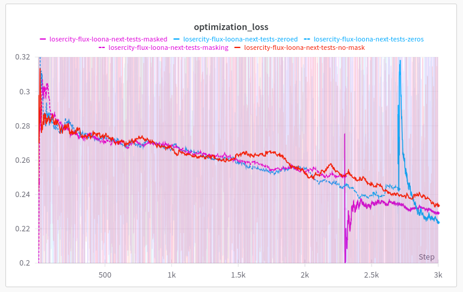
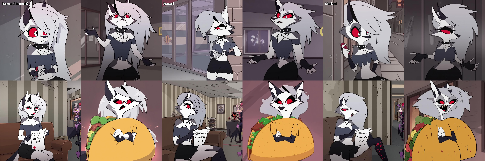
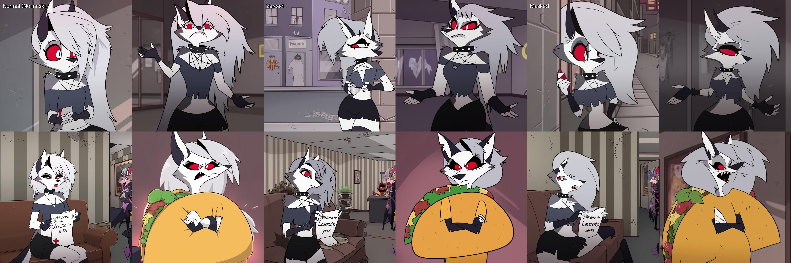
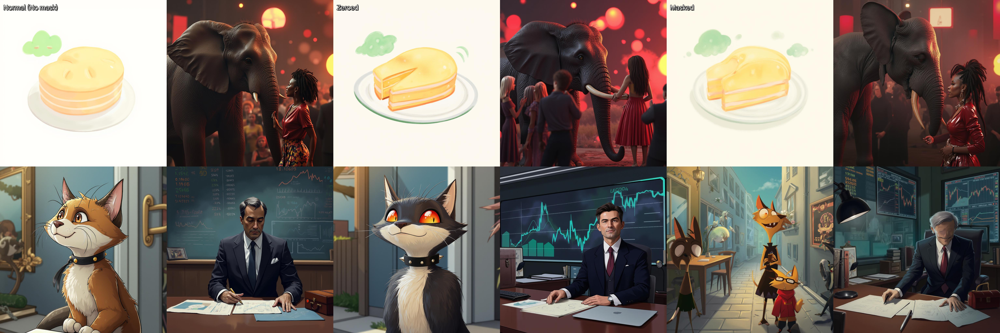
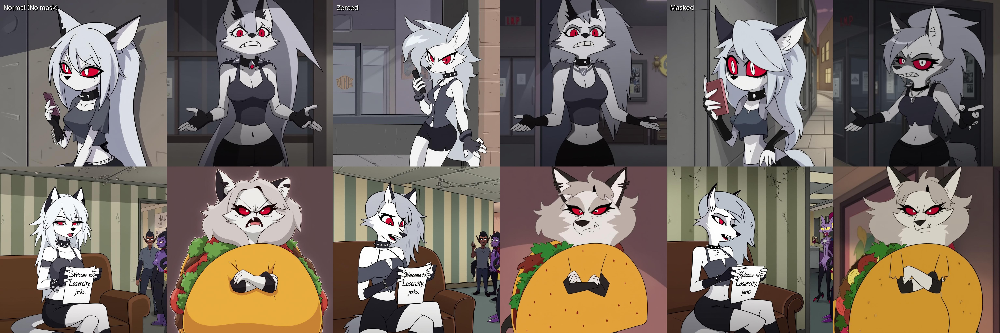

# To Mask or not to Mask
## Low-rank finetuning of Flux-dev with some masking schemes
### Jimmy Carter

There has been some discussion and implementations of various masking schemes for the [Flux series of models](https://huggingface.co/black-forest-labs/). Normally when you train a text-to-image model using a T5 encoder as the text conditioning model, you mask the portions of the text encoder that you don't want the model to learn anything from. Masking is a way to make your attention layers ignore certain tokens that you know are garbage, such as repeating (empty) tokens. This has a nice side effect of letting you run whatever length text-embedding, since the attention layer only focuses on the portion of it you tell it to focus on. This was true for [DeepFloyd IF](https://huggingface.co/DeepFloyd) and the [Pixart family of models](https://huggingface.co/PixArt-alpha).

How is attention masking [implemented](https://pytorch.org/docs/stable/generated/torch.nn.functional.scaled_dot_product_attention.html)? Without going into too much detail, you have two projections, `q` (query) and `k` (key), which form a matrix of vectors that are used to select things from `v` (value), another projection. For self-attention, like in Flux, `q`, `k,` and `v` are all projections on the same data. So, you `q @ k` (`torch.matmul(q, k)`), scale it, softmax to get the attention matrix, and then use that to "look-up" some values from `v`.

The softmax is pretty key here as that's the step to get the attention matrix to some values between 0 and 1. So how do we make sure that vectors we don't care about are ignored in q and k when we mask? Typically we just add `-inf` to them, so that when we run softmax they get set to 0 after, and then can not select any `v` for those vectors we wish to ignore.

Well, what if instead of `-inf` we just set those to something small like 0 when we ship them into the model? Then when we softmax we get a tiny number instead of zero. This only works if your model has no bias terms that could make things like the output non-zero, which Flux does, and it also is not the same as just adding `-inf`:

```py
>>> torch.softmax(torch.tensor([0.0, 10.0, 100.0, float('-Inf')]), 0)
tensor([3.7835e-44, 8.1940e-40, 1.0000e+00, 0.0000e+00])
```

`q @ k` will make a very small value with zero, versus 0. So this seems like a hacky way to approximate attention masking.

That's interesting and all. Flux doesn't have attention masking, so maybe while it's transforming the text downstream in the model things happen to those "empty" tokens and they act like [registers](https://arxiv.org/abs/2309.16588) or have some other non-negligible effect somewhere else. It seems like masking might be a good thing to add, to make sure that the model only pays attention to the stuff it's supposed to. So, I added it to [SimpleTuner](https://github.com/bghira/SimpleTuner) and ran some tests. I also included the "hacky" zeroed out version, where we just zero all the padding tokens.

Here's the results, attempting to train in the character [Loona](https://hazbinhotel.fandom.com/wiki/Loona) from [Helluva Boss](https://www.youtube.com/playlist?list=PL-uopgYBi65HwiiDR9Y23lomAkGr9mm-S) via LoRA for 3000 steps at batch size 4. The validation prompt here shown on the bottom is "loona from helluva boss is eating a donut". At the top is a blank prompt, which can help us see how much we're wrecking the mode.

https://github.com/user-attachments/assets/6472a304-1b5b-4f44-a21f-12a022f722dc

How to interpret these results? Text-to-image finetuning via LoRA for a single character is not quite like other tasks with easy benchmarks to assess the quality of your results. You have to just see which result looks the best to you and run with it. It's pretty clear that the zeroed version seems to learn the style of Helluva Boss faster than the other two, and my hypothesis is that it's simply because using zeroes is so out of distribution with what the model originally learned that it acts as some kind of "special vectors" that indicate that this content is totally unrelated to previous content the model has learned.

Masked looks similar to, but slightly more dramatic than, the normal mask-free training. Which seems to jive: we're not really changing much with the masking except for ignoring some things we normally would pay probably a miniscule amount of attention to during the attention step.

In terms of loss all training types appeared similar (forgive the two restarts, wandb doesn't currently let you connect runs on start-stop):



Okay, let's try some more of my standard prompts, which normally get decent results when I train this LoRA.

```py
loona_prompts = [
    'In this scene from the animated series "Helluva Boss," Loona, the wolf-like receptionist of the Immediate Murder Professionals (I.M.P), is depicted leaning against a wall outside the office. She is casually engrossed in her phone, displaying her typical aloof and detached demeanor. Loona\'s appearance includes her usual whitish fur, light grey hair, black-tipped ears, and red eyes, complemented by her punk-inspired attire featuring a black choker with spikes, a dark grey top, fingerless wrist-length black gloves, and black shorts.',
    'Loona shrugs with an exasperated expression, her red eyes wide and frustrated, as she seemingly questions or challenges something said in the I.M.P office. Still from Helluva boss. Loona\'s appearance includes her usual whitish fur, light grey hair, black-tipped ears, and red eyes, complemented by her punk-inspired attire featuring a black choker with spikes, a dark grey top, fingerless wrist-length black gloves, and black shorts.',
    "A scene from the animated series \"Helluva Boss,\" set in the office. Loona, the wolf-like receptionist with white fur, black-tipped ears, and red eyes, is seated on a couch, facing towards the viewer. Loona\'s appearance is complemented by her punk-inspired attire featuring a black choker with spikes, a dark grey top, fingerless wrist-length black gloves, and black shorts. She holds a piece of paper that says,\"Welcome to Losercity, jerks\". In the background, the office has a striped wall pattern and visible damage on the ceiling, indicating a chaotic or rough environment. On the right side of the image, two imp characters appear to be engaged in conversation.",
    "Loona from Helluva Boss is dressed in an oversized taco costume, looking visibly irritated and embarrassed. Her red eyes convey her annoyance as she crosses her arms and glares to the side. Loona\'s appearance includes her usual whitish fur, light grey hair, black-tipped ears, and red eyes",
]
```

### Some inference results



Well, this looks more like Loona! And here we see some different things. The original model and masked models, which looked less impressive in the video, looks great now. The model where we applied the zeros seems to have some weird artifacts like mangled faces and extra limbs. The masked training looks not so bad, but there is a pretty weird looking face in the taco suit one. Zeros was the only one to consistently get the top right.

We trained them differently, so maybe we should sample them differently. I added a new pipeline that lets you do zero-padding or masking while sampling and retried.

### Corrected inference results



The zero-padded and masked results are slightly improved.

For the zero-padded image with the sign, Loona no longer has extra appendages but no longer seems to follow the prompt as well, which described her as sitting. This might indicate some overfitting, as instead it made a standing Loona and most of the pictures trained on had her standing. The mangled face in the first picture persists.

For the masked image, the one mangled face resolved into something coherent in the last picture, if a bit exaggerated.

It seems like if you train on one of these methods, you should also use then during inference.

### The ugly: unrelated prompt generation

I tried some unrelated prompts to see how much each LoRA style degraded the model, again using inference techniques adjusted to the training style of each model.

```py
prompts = [
    'a 2D simple drawing of a madeleine cake, with a green cloud drawn next to it',
    'a 3D captivating YouTube thumbnail depicting of a full detailed,it\'s on a party real people like, on front there is a giant pulling a nose of a black African real like lady down to size of elephant nose,be creative and unique',
    'Whiskers the cat Whiskers becomes a mentor to other animals.Impressed by Whiskers\' intelligence, other animals in the neighborhood seek his guidance. Whiskers sets up a virtual learning platform using AI technology, where animals can ask questions, receive personalized lessons, and acquire knowledge in various subjects. Whiskers becomes a mentor, helping others unlock their potential.',
    'As the stock market fluctuates, the investor remains calm and collected at their desk, surrounded by charts and graphs. Their tailored suit and polished briefcase are a symbol of their expertise and experience in the world of finance. ',
]
```



The zero-padding trained LoRA seems to have the most bleed from the training dataset, with the cat getting eyes coloured like in the show. The background is gone from the elephant image, with tiny people being replaced with grass and weird floating orbs. In the masked training, the businessman's face seems to have disappeared and the elephant looks a bit off.

If you want to use these techniques without causing side-effects to the model, you may need to do a larger scale finetuning with way more images.

### Your LoRA strength is too high and you cooked them with 3,000 steps!

Not really, here they are with 0.5 strength and they lose a lot of details of the character. I tried strengths between that and 1.0 and there were always tradeoffs.



### You only used the most cooked version of the model, the one at 3,000 steps! Why not sample the other timesteps instead?

I did, here's the video. There doesn't seem to be a huge improvement in any individual checkpoint from the ones I sampled.

https://github.com/user-attachments/assets/f5c3ecbb-dba0-4ae1-b5d5-4d0e2ee98e28

## Conclusion

I am more or less on the fence about masking here, I think if you were to do a large scale finetune on lots of images it might be more useful. The zero-padded LoRA _may_ have trained more quicker and with the adjusted inference seemed to converge around step 2,000 while the others did so later. But, it also seemed to leak more and do some weird things to unrelated prompts. Both zero-padded and masked appear to converge more quickly than the regular, unmasked training. You can use them, or not, either way will probably not hurt your training but then the onus is on the end user to use the correct form of inference. I have no idea what the support for those (zero-padded and actual masking) is in various clients.

## LoRA models

No animals were hurt during the course of this training.

- [No masking](https://huggingface.co/jimmycarter/flux-training-losercity-next-tests-no-mask)
- [Zero-padded](https://huggingface.co/jimmycarter/flux-training-losercity-next-tests-zeroed)
- [Masked](https://huggingface.co/jimmycarter/flux-training-losercity-next-tests-masked)
